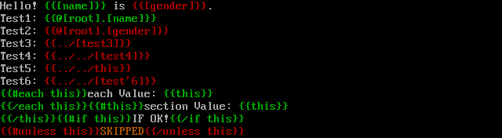

LightnCandy
===========

An extremely fast PHP implementation of handlebars ( http://handlebarsjs.com/ ) and mustache ( http://mustache.github.io/ ).

Travis CI status: [](https://travis-ci.org/zordius/lightncandy) [](https://travis-ci.org/zordius/HandlebarsTest)

Scrutinizer CI status: [](https://scrutinizer-ci.com/g/zordius/lightncandy/)

Package on packagist: [](https://packagist.org/packages/zordius/lightncandy) [](https://github.com/zordius/lightncandy/blob/master/LICENSE.txt) [](https://packagist.org/packages/zordius/lightncandy) [](http://hhvm.h4cc.de/package/zordius/lightncandy)

Features
--------

* Logicless template: mustache ( http://mustache.github.com/ ) or handlebars ( http://handlebarsjs.com/ ) .
* Compile template to **pure PHP** code. Examples:
   * <a href="https://github.com/zordius/HandlebarsTest/blob/master/fixture/001-simple-vars.tmpl">Template A</a> generated <a href="https://github.com/zordius/HandlebarsTest/blob/master/fixture/001-simple-vars.php">PHP A</a>
   * <a href="https://github.com/zordius/HandlebarsTest/blob/master/fixture/016-hb-eachthis.tmpl">Template B</a> generated <a href="https://github.com/zordius/HandlebarsTest/blob/master/fixture/016-hb-eachthis.php">PHP B</a>
* **FAST!**
   * Runs 4~6 times faster than <a href="https://github.com/bobthecow/mustache.php">mustache.php</a>.
   * Runs 4~10 times faster than <a href="https://github.com/dingram/mustache-php">mustache-php</a>.
   * Runs 10~30 times faster than <a href="https://github.com/XaminProject/handlebars.php">handlebars.php</a>.
   * Detail performance test reports can be found <a href="https://github.com/zordius/HandlebarsTest">here</a>, go http://zordius.github.io/HandlebarsTest/ to see charts.
* **SMALL!** single PHP file, only 120K!
* **ROBUST!**
   * 100% support <a href="https://github.com/mustache/spec">mustache spec v1.1.2</a> (without lambda module)
   * Supports almost all <a href="https://github.com/kasperisager/handlebars-spec">handlebars.js spec</a>
   * Output <a href="https://github.com/zordius/HandlebarsTest/blob/master/FEATURES.md">SAME</a> with <a href="https://github.com/wycats/handlebars.js">handlebars.js</a>
* **FLEXIBLE!**
   * Lot of <a href="#compile-options">options</a> to change features and behaviors.
* Context generation
   * Analyze used features from your template (use `LightnCandy::getContext()` to get it) .
* Debug
   * <a href="#template-debugging">Generate debug version template</a>
      * Find out missing data when rendering template.
      * Generate visually debug template.
* Standalone Template
   * The compiled PHP code can run without any PHP library. You do not need to include LightnCandy when execute rendering function.

Installation
------------

Use Composer ( https://getcomposer.org/ ) to install LightnCandy:

```
composer require zordius/lightncandy:dev-master
```

Or, download LightnCandy from github:

```
curl -LO https://github.com/zordius/lightncandy/raw/master/src/lightncandy.php
```

LightnCandy requirement: PHP 5.3.0+ .

**UPGRADE NOTICE**

* Please check <a href="HISTORY.md">HISTORY.md</a> for versions history.
* Please check <a href="UPGRADE.md">UPGRADE.md</a> for upgrade notice.

Usage
-----
```php
// THREE STEPS TO USE LIGHTNCANDY
// Step 1. require the lib, compile template, and get the PHP code as string
require('src/lightncandy.php');

$template = "Welcome {{name}} , You win \${{value}} dollars!!\n";
$phpStr = LightnCandy::compile($template);  // compiled PHP code in $phpStr

// Step 2A. (Usage 1) use LightnCandy::prepare to get rendering function
//   DEPRECATED , it may require PHP setting allow_url_fopen=1 ,
//   and allow_url_fopen=1 is not secure .
//   When allow_url_fopen = 0, prepare() will create tmp file then include it, 
//   you will need to add your tmp directory into open_basedir.
//   YOU MAY NEED TO CHANGE PHP SETTING BY THIS WAY
$renderer = LightnCandy::prepare($phpStr);


// Step 2B. (Usage 2) Store your render function in a file 
//   You decide your compiled template file path and name, save it.
//   You can load your render function by include() later.
//   RECOMMENDED WAY
file_put_contents($php_inc, $phpStr);
$renderer = include($php_inc);


// Step 3. run native PHP render function any time
echo "Template is:\n$template\n\n";
echo $renderer(Array('name' => 'John', 'value' => 10000));
echo $renderer(Array('name' => 'Peter', 'value' => 1000));
```

The output will be:

```
Template is:
Welcome {{name}} , You win ${{value}} dollars!!


Welcome John , You win $10000 dollars!!
Welcome Peter , You win $1000 dollars!!
```

Compile Options
---------------

You can apply more options by running `LightnCandy::compile($template, $options)`:

```php
LightnCandy::compile($template, Array(
    'flags' => LightnCandy::FLAG_ERROR_LOG | LightnCandy::FLAG_STANDALONE
));
```

Default is to compile the template as PHP, which can be run as fast as possible (flags = `FLAG_BESTPERFORMANCE`).

* `FLAG_ERROR_LOG` : error_log() when found any template error
* `FLAG_ERROR_EXCEPTION` : throw exception when found any template error
* `FLAG_ERROR_SKIPPARTIAL` : skip 'partial not found' error/exception. Use this to align with mustache specification.
* `FLAG_NOESCAPE` : do not do any HTML escape on {{var}}.
* `FLAG_STANDALONE` : generate stand-alone PHP codes, which can be execute without including LightnCandy.php. The compiled PHP code will contain scoped user function, somehow larger. And, the performance of the template will slow 1 ~ 10%.
* `FLAG_JSTRUE` : generate 'true' or 'false' when value is true or false (JavaScript behavior). Otherwise, true/false will generate ''.
* `FLAG_JSOBJECT` : generate '[object Object]' for associated array, generate ',' separated values for array (JavaScript behavior). Otherwise, all PHP array will generate '' or 'Array'.
* `FLAG_THIS` : resolve `{{this}}` as `{{.}}` in template. Otherwise, `{{this}}` will be resolved as normal variable.
* `FLAG_WITH` : support `{{#with var}}` in template. Otherwise, `{{#with var}}` will cause template error.
* `FLAG_PARENT` : support `{{../var}}` in template. Otherwise, `{{../var}}` will cause template error.
* `FLAG_JSQUOTE` : escape `'` to `&#x27;` , <code>&#x60;</code> to `&#x60;` . Otherwise, `'` will be escaped to `&#039;` , <code>&#x60;</code> will not be touched.
* `FLAG_ADVARNAME` : support `{{foo.[0].[#te#st].bar}}` style advanced variable naming in template. Use this flag if you wanna use `"some string"` or `(subexpresssion)` as argument.
* `FLAG_NAMEDARG` : support named arguments for custom helper `{{helper name1=val1 nam2=val2 ...}}`.
* `FLAG_EXTHELPER` : do not including custom helper codes into compiled PHP codes. This reduces the code size, but you need to take care of your helper functions when rendering. If you forget to include required functions when execute rendering function, `undefined function` runtime error will be triggered. NOTE: Anonymous functions will always be placed into generated codes.
* `FLAG_RUNTIMEPARTIAL` : compile partial as runtime function, This enables recursive partials or context change for partials.
* `FLAG_SLASH` : Skip a delimiter when it behind `\` .
* `FLAG_ELSE` : support `{{else}}` or `{{^}}` as handlebars specification. Otherwise, `{{else}}` will be resolved as normal variable , and {{^}} will cause template error.
* `FLAG_PROPERTY` : support object instance attribute access. You MUST apply this if your data contains object. And, the rendering performance will be worse.
* `FLAG_METHOD` : support object instance method access. You MUST apply this if your data contains object. And, the rendering performance will be worse.
* `FLAG_INSTANCE` : same with `FLAG_PROPERTY` + `FLAG_METHOD`
* `FLAG_SPACECTL` : support space control `{{~ }}` or `{{ ~}}` in template. Otherwise, `{{~ }}` or `{{ ~}}` will cause template error.
* `FLAG_SPVARS` : support special variables include @root, @index, @key, @first, @last. Otherwise, compile these variable names with default parsing logic.
* `FLAG_JS` : simulate all JavaScript string conversion behavior, same with `FLAG_JSTRUE` + `FLAG_JSOBJECT`.
* `FLAG_HANDLEBARS` : support all handlebars extensions (which mustache do not supports) , same with `FLAG_THIS` + `FLAG_WITH` + `FLAG_PARENT` + `FLAG_JSQUOTE` + `FLAG_ADVARNAME` + `FLAG_NAMEDARG` + `FLAG_SLASH` + `FLAG_ELSE` + `FLAG_MUSTACHESP` + `FLAG_MUSTACHEPAIN`.
* `FLAG_HANDLEBARSJS` : align with handlebars.js behaviors, same with `FLAG_JS` + `FLAG_HANDLEBARS`.
* `FLAG_MUSTACHESP` : align line change and spacing behaviors with mustache specification.
* `FLAG_MUSTACHELOOKUP` : align recursive lookup up behaviors with mustache specification. And, the rendering performance will be worse.
* `FLAG_MUSTACHEPAIN` : align partial indent behavior with mustache specification.
* `FLAG_MUSTACHE` : support all mustache specification, same with `FLAG_ERROR_SKIPPARTIAL` + `FLAG_MUSTACHESP` + `FLAG_MUSTACHELOOKUP` + `FLAG_MUSTACHEPAIN`.
* `FLAG_ECHO` : compile to `echo 'a', $b, 'c';` to improve performance. This will slow down rendering when the template and data are simple, but will improve 1% ~ 7% when the data is big and looping in the template.
* `FLAG_BESTPERFORMANCE` : same with `FLAG_ECHO` now. This flag may be changed base on performance testing result in the future.
* `FLAG_RENDER_DEBUG` : generate debug template to show error when rendering. With this flag, the performance of rendering may be slowed.
* `FLAG_BARE`: generate PHP code without PHP tags `<?php` and `?>`

Partial Support
---------------

LightnCandy supports partial when compile time. You can provide partials by `partials` option when `compile()`:

```php
LightnCandy::compile($template, Array(
    'partials' => Array(
        'name' => 'template: {{name}}',
    ),
));
```

You can also provide partials by files. When `compile()`, LightnCandy will search template files from `basedir` in the option if you provided one or more. Default template file name is `*.tmpl`, you can change or add more template file extensions with `fileext` option. 

```php
// Loading partial from file system only when valid directory is provided by basedir option
// '.' means getpwd()
LightnCandy::compile($template, Array(
    'basedir' => '.'
));

// Multiple basedir and fileext are supported
LightnCandy::compile($template, Array(
    'flags' => LightnCandy::FLAG_STANDALONE,
    'basedir' => Array(
        '/usr/local/share/handlebars/templates',
        '/usr/local/share/my_project/templates',
        '/usr/local/share/my_project/partials',
    ),
    'fileext' => Array(
        '.tmpl',
        '.mustache',
        '.handlebars',
    )
));
```

With this setting, when you include a partial by `{{> partial_name}}`, LightnCandy will search in this order:
* /usr/local/share/handlebars/templates/partial_name.tmpl
* /usr/local/share/handlebars/templates/partial_name.mustache
* /usr/local/share/handlebars/templates/partial_name.handlebars
* /usr/local/share/my_project/templates/partial_name.tmpl
* /usr/local/share/my_project/templates/partial_name.mustache
* /usr/local/share/my_project/templates/partial_name.handlebars
* /usr/local/share/my_project/partials/partial_name.tmpl
* /usr/local/share/my_project/partials/partial_name.mustache
* /usr/local/share/my_project/partials/partial_name.handlebars

By default, partial uses the same context with original template. If you want to change context for the partial, you may add one more argument after the partial name:

```
{{>partial_name .}} // Same as {{>partial_name}}
{{>partial_name foo}} // Change input context to foo, FLAG_RUNTIMEPARTIAL required
{{>partial_name ..}} // use {{..}} as new input context, FLAG_RUNTIMEPARTIAL required

{{>partial_name .. key=bar}} // use {{..}} as new input context, FLAG_RUNTIMEPARTIAL required
                             // also merge key into new context.
```

You can use dynamic partial name by passing a custom helper as subexpression syntax, for example: `{{> (foo)}}` . the return value of custom helper `foo` will be the partial name. When you using dynamic partial, LightnCandy will compile all partial inside the `partials` option into template. (**TODO: add an example to show how to provide partials across templates to reduce size**)

Custom Helper
-------------

Custom helper can help you deal with common template tasks, for example: provide URL and text then generate a link. To know more about custom helper, you can read original handlebars.js document here: http://handlebarsjs.com/expressions.html . 

**NOTICE**: custom helpers to handle single tag `{{xxx}}` or a section `{{#yyy}} ... {{/yyy}}` are absolutely different in LightnCandy. To know more about creating custom helpers to handle `{{#yyy}} ... {{/yyy}}`, please refer to <a href="#block-custom-helper">Block Custom Helper</a>.

When `compile()`, LightnCandy will lookup helpers from generated custom helper name table. You can register custom helpers with `helpers` option (**NOTICE**: `FLAG_NAMEDARG` is required for named arguments, `FLAG_ADVARNAME` is required for string or subexpression arguments):

```php
LightnCandy::compile($template, Array(
    // FLAG_NAMEDARG is required if you want to use named arguments
    'flags' => LightnCandy::FLAG_HANDLEBARS
    'helpers' => Array(
        // 1. You may pass your function name
        //    When the function is not exist, you get compile time error
        //    In this case, the helper name is same with function name
        //    Template: {{my_helper_functoin ....}}
        'my_helper_function',

        // 2. You may also provide a static call from a class
        //    In this case, the helper name is same with provided full name
        //    **DEPRECATED** It is not valid in handlebars.js 
        //    Template: {{myClass::myStaticMethod ....}}
        'myClass::myStaticMethod',

        // 3. You may also provide an alias name for helper function
        //    This help you to mapping different function to a preferred helper name
        //    Template: {{helper_name ....}}
        'helper_name' => 'my_other_helper',

        // 4. Alias also works well for static call of a class
        //    This help you to mapping different function to a preferred helper name
        //    Template: {{helper_name2 ....}}
        'helper_name2' => 'myClass::func',

        // 5. Anonymous function should be provided with alias
        //    The function will be included in generaed code always
        //    Template: {{helper_name3 ....}}
        'helper_name3' => function ($arg1, $arg2) {
            return "<a href=\"{$arg1}\">{$arg2}</a>";
        }
    )
));
```

Custom Helper Interface
-----------------------

The input arguments are processed by LightnCandy automatically, you do not need to worry about variable name processing or current context. You can also use double quoted string as input:

```
{{{helper name}}}           // This send processed {{{name}}} into the helper
{{{helper ../name}}}        // This send processed {{{../name}}} into the helper
{{{helper "Test"}}}         // This send the string "Test" into the helper (FLAG_ADVARNAME is required)
{{helper "Test"}}           // This send the string "Test" into the helper and escape the helper result
{{{helper "Test" ../name}}} // This send string "Test" as first parameter,
                            // and processed {{{../name}}} as second parameter into the helper
```

Your custom helper function will be executed with two arguments. The first one is noname arguments, the second one is named arguments:

```php
function myhelper ($args, $named) {
    if (count($args)) {
        // handle no name arguments....
    }
    // access foo=bar from $named['foo'] ...
}
```

In your template:

```
{{{helper name=value}}}        // This send processed {{{value}}} into $named['name']
{{{helper name="value"}}}      // This send the string "value" into $named['name']
{{{helper [na me]="value"}}}   // You can still protect the name with [ ]
                               // so you get $named['na me'] as the string 'value'
{{{helper url name="value"}}}  // This send processed {{{url}}}  into $args[0]
                               // and the string "value" into $named['name']
```

Custom Helper Escaping
----------------------

The return value of your custom helper should be a string. When your custom helper be executed from {{ }} , the return value will be HTML escaped. You may execute your helper by {{{ }}} , then the original helper return value will be outputted directly.

When you need to do different escaping logic, you can return extended information by Array($responseString, $escape_flag) , here are some custom helper return value cases:

```php
// escaping is handled by lightncandy and decided by template
// if the helper is in {{ }} , you get 'The U&amp;ME Helper is ececuted!'
// if the helper is in {{{ }}} , you get 'The U&ME Helper is executed!'
return 'The U&ME Helper is executed!';

// Same as above because the escape_flag is DEFAULT
// 0, false, null, undefined, or '' means DEFAULT
return Array('The U&ME Helper is executed!');
return Array('The U&ME Helper is executed!', false);
return Array('The U&ME Helper is executed!', 0);

// escaping is handled by the helper, lightncandy will do nothing
// No matter in {{ }} or {{{ }}} , you get 'Exact&Same output \' \" Ya!'
return Array('Exact&Same output \' " Ya!', 'raw');

// force lightncandy escaping the helper result
// No matter in {{ }} or {{{ }}} , you get 'Not&amp;Same output &#039; &quot; Ya!'
return Array('Not&Same output \' " Ya!', 'enc');

// force lightncandy escaping the helper result in handlebars.js way
// No matter in {{ }} or {{{ }}} , you get 'Not&amp;Same output &#x27; &quot; Ya!'
return Array('Not&Same output \' " Ya!', 'encq');
```

In most case, a custom helper should always return a string. If you design a custom helper to be executed inside a subexpression, you can return an object or an array by this way:

```php
// return an object
return Array($anObject, 'asis');

// in another way
return Array($anObject, 'raw');

// return Array(1, 3, 5)
return Array(Array(1, 3, 5), 'any_string_but_not_enc_nor_encq');
```

Block Custom Helper
-------------------

Block custom helper must be used as a section, the section is started with `{{#helper_name ...}}` and ended with `{{/helper_name}}`.

You may use block custom helper to:

1. Provide advanced condition logic which is different from `{{#if ...}}` ... `{{/if}}` .
2. Modify current context for the inner block.
3. Provide different context to the inner block.

You can register block custom helpers with `blockhelpers` option:

```php
LightnCandy::compile($template, Array(
    'blockhelpers' => Array(    // The usage of blockhelpers option is similar with helpers option.
        'my_helper_function',   // You can use function name, class name with static method,
        ...                     // and choose preferred helper name by providing key name.
    )
));
```

Block Custom Helper Interface
-----------------------------

LightnCandy handled all input arguments for you, you will receive current context and parsed arguments. The return value of helper function will become new context then be passed into inner block. If you do not return any value, or return null, the inner block will not be rendered. For example:

```php
// Only render inner block when input > 5
// {{#helper_iffivemore total_people}}More then 5 people, discount!{{/helper_iffivemore}}
function helper_iffivemore($cx, $args, $named) {
    return $args[0] > 5 ? $cx : null;
}

// You can use named arguments, too
// {{#helper_if value=people logic="more" tovalue=5}}Yes the logic is true{{/helper_if}}
function helper_if($cx, $args, $named) {
    switch ($args['logic']) {
    case 'more':
        return $named['value'] > $named['tovalue'] ? $cx : null;
    case 'less':
        return $named['value'] < $named['tovalue'] ? $cx : null;
    case 'eq':
        return $named['value'] == $named['tovalue'] ? $cx : null;
    }
}

// Provide default values for name and salary
// {{#helper_defaultpeople}}Hello, {{name}} ....Your salary will be {{salary}}{{/helper_defaultpeople}}
function helper_defaultpeople($cx, $args, $named) {
    if (!isset($cx['name'])) {
        $cx['name'] = 'Sir';
    }
    $cx['salary'] = isset($cx['salary']) ? '$' . $cx['salary'] : 'unknown';
    return $cx;
}

// Provide specific context to innerblock
// {{#helper_sample}}Preview Name:{{name}} , Salary:{{salary}}.{{/helper_sample}}
function helper_sample($cx, $args) {
    return Array('name' => 'Sample Name', 'salary' => 'Sample Salary');
}
```

You cannot provide new rendered result, nor handle loop in your block custom helper. To provide different rendering result, you should use <a href="#custom-helper">custom helper</a>. To handle loop, you should use `{{#each}}` . For example:

```php
// Provide specific context to innerblock, then loop on it.
// {{#helper_categories}}{{#each .}}<li><a href="?id={{id}}">{{name}}</a></li>{{/each}}{{/helper_categories}}
function helper_categories($cx, $args) {
    return getMyCategories(); // Array('category1', 'category2', ...)
}
```

The mission of a block custom helper is only focus on providing different context or logic to inner block, nothing else. If you like to do things beyond these restrictions, please using `hbhelpers` and keep reading to next section.

Handlebars.js' Custom Helper
----------------------------

You can implement helpers more like Handlebars.js way with `hbhelpers` option, all matched single custom helper and block custom helper will be handled. In Handlebars.js, a block custom helper can rendener child block by executing `options.fn`; or change context by send new context as first parameter. Here are some examples to explain the behavior of `hbhelpers` custom helper:

**#mywith (context change)**
* LightnCandy
```php
// LightnCandy sample, #mywith works same with #with
$php = LightnCandy::compile($template, Array(
    'flags' => LightnCandy::FLAG_HANDLEBARSJS,
    'hbhelpers' => Array(
        'mywith' => function ($context, $options) {
            return $options['fn']($context);
        }
    )
));
```

* Handlebars.js
```javascript
// Handlebars.js sample, #mywith works same with #with
Handlebars.registerHelper('mywith', function(context, options) {
    return options.fn(context);
});
```

**#myeach (context change)**
* LightnCandy
```php
// LightnCandy sample, #myeach works same with #each
$php = LightnCandy::compile($template, Array(
    'flags' => LightnCandy::FLAG_HANDLEBARSJS,
    'hbhelpers' => Array(
        'myeach' => function ($context, $options) {
            $ret = '';
            foreach ($context as $cx) {
                $ret .= $options['fn']($cx);
            }
            return $ret;
        }
    )
));
```

* Handlebars.js
```javascript
// Handlebars.js sample, #myeach works same with #each
Handlebars.registerHelper('myeach', function(context, options) {
    var ret = '', i, j = context.length;
    for (i = 0; i < j; i++) {
        ret = ret + options.fn(context[i]);
    }
    return ret;
});
```

**#myif (no context change)**
* LightnCandy
```php
// LightnCandy sample, #myif works same with #if
$php = LightnCandy::compile($template, Array(
    'flags' => LightnCandy::FLAG_HANDLEBARSJS,
    'hbhelpers' => Array(
        'myif' => function ($conditional, $options) {
            if ($conditional) {
                return $options['fn']();
            } else {
                return $options['inverse']();
            }
        }
    )
));
```

* Handlebars.js
```javascript
// Handlebars.js sample, #myif works same with #if
Handlebars.registerHelper('myif', function(conditional, options) {
    if (conditional) {
        return options.fn(this);
    } else {
        return options.inverse(this);
    }
});
```

**Hashed arguments**
* LightnCandy
```php
$php = LightnCandy::compile($template, Array(
    'flags' => LightnCandy::FLAG_HANDLEBARSJS,
    'hbhelpers' => Array(
        'sample' => function ($arg1, $arg2, $options) {
            // All hashed arguments are in $options['hash']
        }
    )
));
```

* Handlebars.js
```javascript
Handlebars.registerHelper('sample', function(arg1, arg2, options) {
    // All hashed arguments are in options.hash
});
```

**Data variables and context**

You can get special data variables from `$options['data']`. Using `$options['_this']` to receive current context.

```php
$php = LightnCandy::compile($template, Array(
    'flags' => LightnCandy::FLAG_HANDLEBARSJS,
    'hbhelpers' => Array(
        'getRoot' => function ($options) {
            print_($options['_this']); // dump current context
            return $options['data']['root']; // same as {{@root}}
        }
    )
));
```

* Handlebars.js
```javascript
Handlebars.registerHelper('getRoot', function(options) {
    console.log(this); // dump current context
    return options.data.root; // same as {{@root}}
});
```

**Escaping**

When a Handlebars.js style custom helper be used as block tags, LightnCandy will not escape the result. When it is a single {{...}} tag, LightnCandy will escape the result. To change the escape behavior, you can return extended information by Array(), please read <a href="#custom-helper-escaping">Custom Helper Escaping</a> for more.

Template Debugging
------------------

When template error happened, LightnCandy::compile() will return false. You may compile with `FLAG_ERROR_LOG` to see more error message, or compile with `FLAG_ERROR_EXCEPTION` to catch the exception.

You may generate debug version of templates with `FLAG_RENDER_DEBUG` when compile() . The debug template contained more debug information and slower (TBD: performance result) , you may pass extra LCRun3 options into render function to know more rendering error (missing data). For example:

```php
$template = "Hello! {{name}} is {{gender}}.
Test1: {{@root.name}}
Test2: {{@root.gender}}
Test3: {{../test3}}
Test4: {{../../test4}}
Test5: {{../../.}}
Test6: {{../../[test'6]}}
{{#each .}}
each Value: {{.}}
{{/each}}
{{#.}}
section Value: {{.}}
{{/.}}
{{#if .}}IF OK!{{/if}}
{{#unless .}}Unless not OK!{{/unless}}
";

// compile to debug version
$php = LightnCandy::compile($template, Array(
    'flags' => LightnCandy::FLAG_RENDER_DEBUG | LightnCandy::FLAG_HANDLEBARSJS
));

// Get the render function
$renderer = LightnCandy::prepare($php);

// error_log() when missing data:
//   LCRun3: [gender] is not exist
//   LCRun3: ../[test] is not exist
$renderer(Array('name' => 'John'), LCRun3::DEBUG_ERROR_LOG);

// Output visual debug template with ANSI color:
echo $renderer(Array('name' => 'John'), LCRun3::DEBUG_TAGS_ANSI);

// Output debug template with HTML comments:
echo $renderer(Array('name' => 'John'), LCRun3::DEBUG_TAGS_HTML);
```

The ANSI output will be: 

<a href="tests/example_debug.php"></a>

Here are the list of LCRun3 debug options for render function:

* `DEBUG_ERROR_LOG` : error_log() when missing required data
* `DEBUG_ERROR_EXCEPTION` : throw exception when missing required data
* `DEBUG_TAGS` : turn the return value of render function into normalized mustache tags
* `DEBUG_TAGS_ANSI` : turn the return value of render function into normalized mustache tags with ANSI color
* `DEBUG_TAGS_HTML` : turn the return value of render function into normalized mustache tags with HTML comments

Customize Render Function
-------------------------

If you want to do extra tasks inside render function or add more comment, you may use `renderex` when `compile()` . For example, this sample embed the compile time comment into the template:

```php
$php = LightnCandy::compile($template, Array(
    'flags' => LightnCandy::FLAG_HANDLEBARSJS,
    'renderex' => '// Compiled at ' . date('Y-m-d h:i:s')
));
```

Your render function will be:

```php
function ($in) {$
    $cx = array(...);
    // compiled at 1999-12-31 00:00:00
    return .....
}
```

Please make sure the passed in `renderex` is valid PHP, LightnCandy will not check it.

Customize Rendering Runtime Class
---------------------------------

If you want to extend `LCRun3` class and replace default rendering runtime library, you may use `lcrun` when `compile()` . For example, this sample will generate render function based on your extended `MyLCRunClass`:

```php
// Customized rendering runtime library to debug {{{foo}}}
class MyLCRunClass extends LCRun3 {
    public static function raw($cx, $v) {
        return '[[DEBUG:raw()=>' . var_export($v, true) . ']]';
    }
}

// Use MyLCRunClass as rendering runtime library
$php = LightnCandy::compile($template, Array(
    'flags' => LightnCandy::FLAG_HANDLEBARSJS,
    'lcrun' => 'MyLCRunClass'
));
```

Please make sure `MyLCRunClass` exists when compile() or rendering based on your `FLAG_STANDALONE` .

Unsupported Feature (so far)
----------------------------

* [NEVER] `{{foo/bar}}` style variable name, it is deprecated in official handlebars.js document, please use this style: `{{foo.bar}}`.
* [maybe] mustache lambda : runtime time compile based on input value is far from lightncandy nature, not in the plan now.

Suggested Handlebars Template Practices
---------------------------------------

* Prevent to use `{{#with}}` . I think `{{path.to.val}}` is more readable then `{{#with path.to}}{{val}}{{/with}}`; when using `{{#with}}` you will confusing on scope changing. `{{#with}}` only save you very little time when you access many variables under same path, but cost you a lot time when you need to understand then maintain a template.
* use `{{{val}}}` when you do not require HTML escaped output on the value. It is better performance, too.
* If you wanna display `{{`, use this: `{{{"{{"}}}`, prevent using `\{{`.
* Prevent to use custom helper if you want to reuse your template in different language. Or, you may need to implement different versions of helper in different languages.
* For best performance, you should only use 'compile on demand' pattern when you are in development stage. Before you go to production, you can `LightnCandy::compile()` on all your templates, save all generated PHP codes, and deploy these generated files (You may need to maintain a build process for this) . **DO NOT COMPILE ON PRODUCTION** , it also a best practice for security. Adding cache for 'compile on demand' is not the best solution. If you want to build some library or framework based on LightnCandy, think about this scenario.
* Recompile your templates when you upgrade LightnCandy every time.

Detail Feature list
-------------------

Go http://handlebarsjs.com/ to see more feature description about handlebars.js. All features align with it.

* Exact same CR/LF behavior with handlebars.js
* Exact same CR/LF bahavior with mustache spec (require `FLAG_MUSTACHESP`)
* Exact same 'true' or 'false' output with handlebars.js (require `FLAG_JSTRUE`)
* Exact same '[object Object]' output or join(',' array) output with handlebars.js (require `FLAG_JSOBJECT`)
* Can place heading/tailing space, tab, CR/LF inside `{{ var }}` or `{{{ var }}}`
* Indent behavior of the partial same with mustache spec (require `FLAG_MUSTACHEPAIN`)
* Recursive variable lookup to parent context behavior same with mustache spec (require `FLAG_MUSTACHELOOKUP`)
* `{{{value}}}` or `{{&value}}` : raw variable
   * true as 'true' (require `FLAG_JSTRUE`)
   * false as 'false' (require `FLAG_TRUE`)
* `{{value}}` : HTML escaped variable
   * true as 'true' (require `FLAG_JSTRUE`)
   * false as 'false' (require `FLAG_JSTRUE`)
* `{{{path.to.value}}}` : dot notation, raw
* `{{path.to.value}}` : dot notation, HTML escaped 
* `{{.}}` : current context, HTML escaped
* `{{{.}}}` : current context, raw
* `{{this}}` : current context, HTML escaped (require `FLAG_THIS`)
* `{{{this}}}` : current context, raw (require `FLAG_THIS`)
* `{{#value}}` : section
   * false, undefined and null will skip the section
   * true will run the section with original scope
   * All others will run the section with new scope (includes 0, 1, -1, '', '1', '0', '-1', 'false', Array, ...)
* `{{/value}}` : end section
* `{{^value}}` : inverted section
   * false, undefined and null will run the section with original scope
   * All others will skip the section (includes 0, 1, -1, '', '1', '0', '-1', 'false', Array, ...)
* `{{! comment}}` : comment
* `{{!-- comment or {{ or }} --}}` : extended comment that can contain }} or {{ .
* `{{=<% %>=}}` : set delimiter to custom string , the custom string can not contain `=` . Check http://mustache.github.io/mustache.5.html for more example.
* `{{#each var}}` : each loop
* `{{#each}}` : each loop on {{.}}
* `{{/each}}` : end loop
* `{{#if var}}` : run if logic with original scope (null, false, empty Array and '' will skip this block)
* `{{/if}}` : end if
* `{{else}}` or `{{^}}` : run else logic, should between `{{#if var}}` and `{{/if}}` ; or between `{{#unless var}}` and `{{/unless}}`; or between `{{#foo}}` and `{{/foo}}`; or between `{{#each var}}` and `{{/each}}`; or between `{{#with var}}` and `{{/with}}`. (require `FLAG_ELSE`)
* `{{#unless var}}` : run unless logic with original scope (null, false, empty Array and '' will render this block)
* `{{#with var}}` : change context scope. If the var is false, skip included section. (require `FLAG_WITH`)
* `{{../var}}` : parent template scope. (require `FLAG_PARENT`)
* `{{>file}}` : partial; include another template inside a template.
* `{{>file foo}}` : partial with new context (require `FLAG_RUNTIMEPARTIAL`)
* `{{>file foo bar=another}}` : partial with new context which mixed with followed key value (require `FLAG_RUNTIMEPARTIAL`)
* `{{>(helper) foo}}` : include dynamic partial by name provided from a helper (require `FLAG_RUNTIMEPARTIAL`)
* `{{@index}}` : references to current index in a `{{#each}}` loop on an array. (require `FLAG_SPVARS`)
* `{{@key}}` : references to current key in a `{{#each}}` loop on an object. (require `FLAG_SPVARS`)
* `{{@root}}` : references to root context. (require `FLAG_SPVARS`)
* `{{@first}}` : true when looping at first item. (require `FLAG_SPVARS`)
* `{{@last}}` : true when looping at last item. (require `FLAG_SPVARS`)
* `{{@root.path.to.value}}` : references to root context then follow the path. (require `FLAG_SPVARS`)
* `{{@../index}}` : access to parent loop index. (require `FLAG_SPVARS` and `FLAG_PARENT`)
* `{{@../key}}` : access to parent loop key. (require `FLAG_SPVARS` and `FLAG_PARENT`)
* `{{foo.[ba.r].[#spec].0.ok}}` : references to $CurrentConext['foo']['ba.r']['#spec'][0]['ok'] . (require `FLAG_ADVARNAME`)
* `{{~any_valid_tag}}` : Space control, remove all previous spacing (includes CR/LF, tab, space; stop on any none spacing character) (require `FLAG_SPACECTL`)
* `{{any_valid_tag~}}` : Space control, remove all next spacing (includes CR/LF, tab, space; stop on any none spacing character) (require `FLAG_SPACECTL`)
* `{{{helper var}}}` : Execute custom helper then render the result
* `{{helper var}}` : Execute custom helper then render the HTML escaped result
* `{{helper "str"}}` or `{{helper 'str'}}` : Execute custom helper with string arguments (require `FLAG_ADVARNAME`)
* `{{helper 123 null true false undefined}}` : Pass number, true, false, null or undefined into helper
* `{{helper name1=var name2=var2}}` : Execute custom helper with named arguments (require `FLAG_NAMEDARG`)
* `{{#helper ...}}...{{/helper}}` : Execute block custom helper
* `{{helper (helper2 foo) bar}}` : Execute custom helpers as subexpression (require `FLAG_ADVARNAME`)

Framework Integration
---------------------

- [Slim 3.0.x](https://github.com/endel/slim-lightncandy-view)
- [Laravel 4](https://github.com/samwalshnz/lightncandy-l4)
